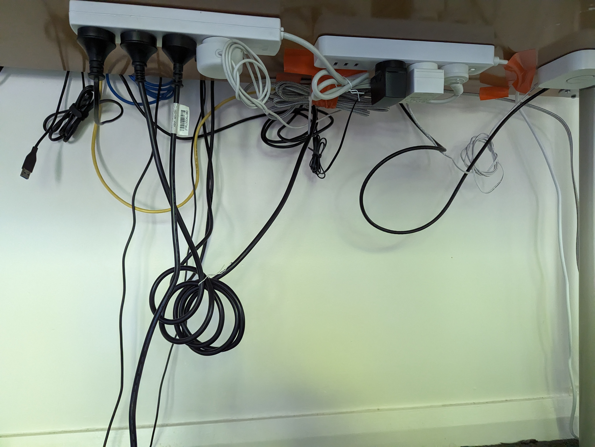
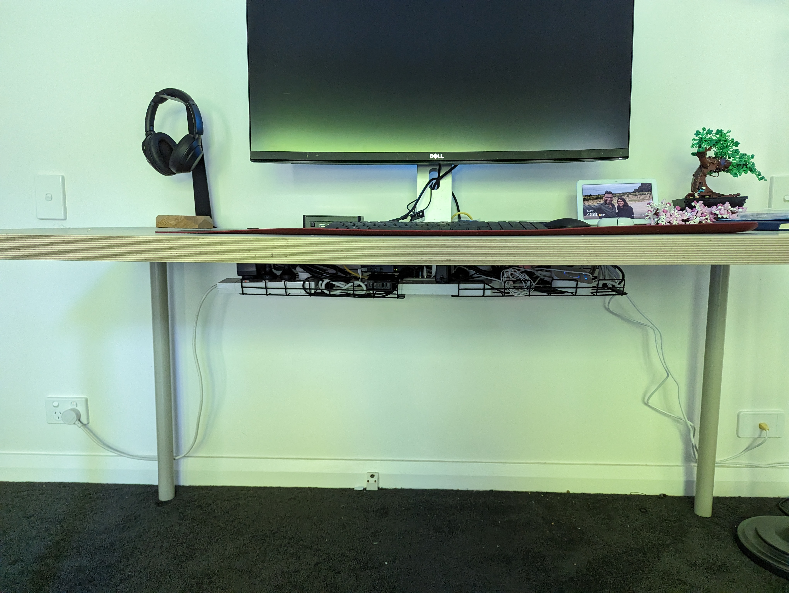
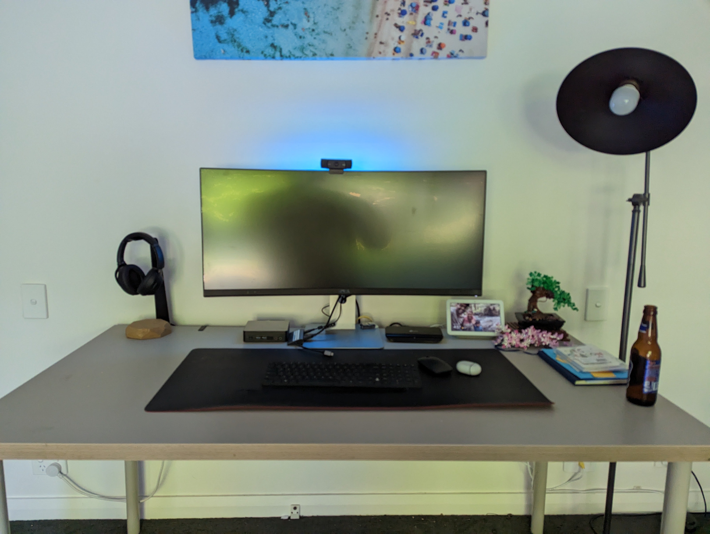

So first things first, just like a chef needs to keep their bench clean, think this is the perfect time to clean up my office table. More importantly this cable situation that has been driving me **INSANE**

### Cable Management

I've had a couple of attempts at cable management but it has always been *half-arsed* and heavy on the duct tape. It was time to do this properly. I bought a couple of [cable cradles](https://www.amazon.com.au/gp/product/B09NVYV5NB/ref=ppx_yo_dt_b_search_asin_title?ie=UTF8&psc=1) from Amazon that fit nicely under the table. From there it was relativey easy to run all the cables and extension cords through. Here's the final result:

