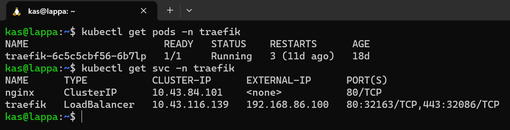

# Reverse proxy for K3s cluster

Now that I have load balancer to expose my services externally, I have a couple of options:

* Expose every service I deploy over metallb (ie. each app gets its own IP address) or;
* Deploy a **reverse proxy** which intercepts and routes every incoming request to the corresponding backend services.

From the title, you can tell which option I went with. I went with the reverse proxy option because

* I don't know how many applications I will eventually host
* I also don't need to think about which application is associated with which IP and configure DNS routes etc
* It can also provide SSL termination and can be used with an ACME provider (like Let’s Encrypt) for automatic certificate generation (which I'll cover in a future post)

## Installing Traefik

Like Metallb, there are heaps of reverse proxy options out there but I went with a popular option [Traefik](https://traefik.io/traefik/).


I wanted to try installing this via helm this time. Helm allows you specify custom configuration values via a `values.yaml` file so I did that first. I know its quite long but I just tweaked the defaults:

```yaml title="values.yaml"
globalArguments:
  - "--global.sendanonymoususage=false"
  - "--global.checknewversion=false"

additionalArguments:
  - "--serversTransport.insecureSkipVerify=true"
  - "--log.level=INFO"

deployment:
  enabled: true
  replicas: 1
  annotations: {}
  podAnnotations: {}
  additionalContainers: []
  initContainers: []

ports:
  web:
    redirectTo: websecure
  websecure:
    tls:
      enabled: true

ingressRoute:
  dashboard:
    enabled: false

providers:
  kubernetesCRD:
    enabled: true
    ingressClass: traefik-external
    allowExternalNameServices: true
  kubernetesIngress:
    enabled: true
    allowExternalNameServices: true
    publishedService:
      enabled: false

rbac:
  enabled: true

service:
  enabled: true
  type: LoadBalancer
  annotations: {}
  labels: {}
  spec:
    loadBalancerIP: 192.168.86.100 # this should be an IP in the MetalLB range
  loadBalancerSourceRanges: []
  externalIPs: []
```

Then I needed to execute these commands to install via helm (after installing [helm](https://helm.sh/) of course):

Add repo
```bash
helm repo add traefik https://helm.traefik.io/traefik
```

Update repo
```bash 
helm repo update
```
Create namespace
```bash
kubectl create namespace traefik
```
Finally install using helm and our custom values file:
```bash
helm install --namespace=traefik traefik traefik/traefik --values=values.yaml
```

## Verifying installation

Finally it was time to check if installation succeeded. 



What a beautiful sight, it is all working. The main thing I was happy to see was that Metallb did the job too by assigning the IP `192.168.86.100` to the traefik service. This means I can now route all incoming request (regardless of which application) to this IP and traefik will handle all the routing. This will be done through domain names which will be covered in a later post.


