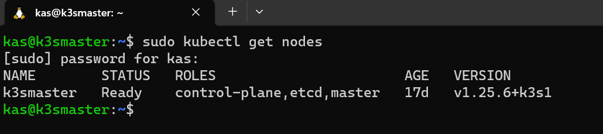
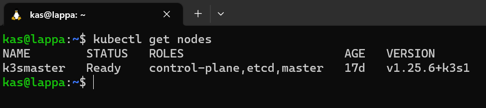

# Kubernetes cluster set up

So with my hardware set up, it was time to get my software up and running. One of the main objectives of setting up this homelab was to get familiar with kubernetes so we need to get a cluster up and running so I can do more than this:


## Installing an OS

I needed to get an OS installed on my NUC before anything else. There are plenty of open source options out there but I stuck with trusty [Ubuntu Server 22.04.1 LTS ](https://ubuntu.com/download/server)

## K8s vs K3s

Before I got stuck into deploying my kubernetes I wanted to investigate what options I had for a homelab. It boiled down to two main ones: K8s vs K3s. Both K8s and K3s share the same source code but the key difference for me was that K3s was significantly more lightweight, can be deployed much faster and still all all the key capabilities of K8s. There are a number of "production grade" features that are excluded from K3s such has handling of complex applications and intergrations with public cloud providers which I didn't require.

## Installing K3s

Installing K3s couldn't be more easier out of the box and it takes no time at all. I simply needed to ssh into my freshly install ubuntu server and execute the following command:

```bash
curl -sfL https://get.k3s.io | sh - 
```

and to uninstall it is:

```bash
/usr/local/bin/k3s-uninstall.sh
```

I must admit I ran these commands **ALOT** because there were a number of things that were installed by default which I didn't need (yet). I'm not going to get into the various customisable configuration options here but there is some pretty good [documentation](https://docs.k3s.io/installation/configuration) for it. After tweaking my configuration, I ended up with the following command to install the cluster I wanted:

```bash
curl -sfL https://get.k3s.io | K3S_KUBECONFIG_MODE="644" INSTALL_K3S_EXEC="--disable traefik --disable servicelb --disable kube-proxy --disable local-storage --cluster-init --tls-san 10.43.0.1" sh -s -
```

## Accessing my K3s cluster

Ok time to run my first kubectl command. To verify that everything was running properly I run:

```bash
sudo kubectl get nodes
```

which shows me my single node in my cluster is up and running:



I needed to run it in sudo which I thought was annoying -I had to fix this (OCD much?). The K3s kubeconfig file is stored at a rancher location /etc/rancher/k3s. 
I *think* this is why I needed to run kubectl in sudo. So I ran the following steps to rectify that:

Create .kube directory in my home directory

```bash
sudo mkdir /home/kas/.kube
```

Copy the kubeconfig file into the newly created directory

```bash
sudo cp /etc/rancher/k3s/k3s.yaml /home/kas/.kube/config
```

Change ownership of the directory so that root wasn't needed
```bash
sudo chown kas:kas /home/kas/.kube/config
```
Let K3s know the location of the new config file (and hopefully the last time I have to use sudo for kubectl)

```bash
sudo kubectl config set-cluster default --server=https://192.168.86.41:6443 --kubeconfig /home/kas/.kube/config
```

I wanted to ensure I could access my cluster from my laptop without having to SSH into my ubuntu server (k3smaster) everytime. To do this I needed copy the kubeconfig file across to my laptop using scp:

From my laptop I run:

```bash
scp k3smaster:/home/kas/.kube/config /home/kas/.kube/config
```

...and I'm laughing::

