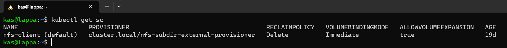

# Storage classes, persistent volumes and NFS

Containers and pods are ephemeral, kubernetes provides a great advantage of being able to orchestrate the deployment, scaling, deletion of pods. But what about storage? If we use a pod's local filesystem for a given application and that pod is deleted, the application data disappears with it. To solve for this, we need to leverage kubernetes **storage classes**. Kubernetes supports a number of [various storage classes](https://kubernetes.io/docs/concepts/storage/storage-classes/#provisioner) ranging from public cloud storage offering to local file storage. Think the best option for me is a [NFS](https://kubernetes.io/docs/concepts/storage/storage-classes/#nfs)

## Installing an NFS server

So if I were to do this properly, I'd be running a NAS or NFS box but since I've skimped on the hardware, I'll be installing a NFS server on the same server as my cluster. You might be thinking *"mate, that's just the same as local storage"* and you would be right but I wanted to eventually switch to a separate NAS so figured I'd just learn how to do this.

There are plenty of tutorials available on how to install NFS on Ubuntu but i followed this one. Here are the key commands I took away to get the job done:

Install the NFS server and export `/nfs` which is accessible by the Kubernetes cluster:

```bash
sudo su
apt update && apt -y upgrade
apt install -y nfs-server
exit

mkdir /nfs
cat << EOF >> /etc/exports
/nfs 192.168.86.41(rw,no_subtree_check,no_root_squash)
EOF

systemctl enable --now nfs-server
exportfs -ar
```

If I ever add another node to my cluster I need to ensure that a NFS client package is installed  able to connect to the NFS server but this isn't required as my NFS server is the same as my Kubernetes node:

```bash
apt install -y nfs-common
```

## Persistent Volumes

Now that I have a storage location, it is probably worth mentioning that the kubernetes rescource associated to persistent storage is **Persistent Volumes**. Like any other resource, I can provision persistent volumes declaritively to whatever storage class I specify.

Once a persistent volume is created, an application deployment can leverage the persistent volume using a **Persistent Volume Claim**. I could be wrong here but I think only one persistent volume claim can be applied to a persistent volume.

## Dynamic Provisioning of Persistent Volumes

Kubernetes also provides you the ability to dynamically provision storage to applications. I found a nifty little tool that someone made called [NFS subdir external provisioner](https://github.com/kubernetes-sigs/nfs-subdir-external-provisioner) which is an automatic provisioner that uses your existing and already configured NFS server to support dynamic provisioning of Kubernetes Persistent Volumes via Persistent Volume Claims. Persistent volumes are provisioned as `${namespace}-${pvcName}-${pvName}`. To install this I run:

```bash
helm repo add nfs-subdir-external-provisioner https://kubernetes-sigs.github.io/nfs-subdir-external-provisioner

helm install nfs-subdir-external-provisioner nfs-subdir-external-provisioner/nfs-subdir-external-provisioner \
  --create-namespace \
  --namespace nfs-provisioner \
  --set nfs.server=192.168.86.41 \
  --set nfs.path=/nfs
```

## Testing the provisioner

To test the provisioner I run:

```bash
kubectl get sc
```



And will use following persistent volume claim manifest:

```yaml
apiVersion: v1
kind: PersistentVolumeClaim
metadata:
  name: nfs-test
  labels:
    storage.k8s.io/name: nfs
    storage.k8s.io/part-of: kubernetes-complete-reference
    storage.k8s.io/created-by: ssbostan
spec:
  accessModes:
    - ReadWriteMany
  storageClassName: nfs-client
  resources:
    requests:
      storage: 1Gi
```

Things of note here:

* `name` will vary for each volume claim - I will use the convention of `<app_name>-pvc`
* `labels` doesn't change for my needs
* `accessModes` doesn't change for my needs
* `storageClassName` doesn't change for my needs
* `storage` will vary for the app but worth noting that the whole specified range is provisioned (not just what you use)


That covers all the core cluster services I reckon, time to install some apps!