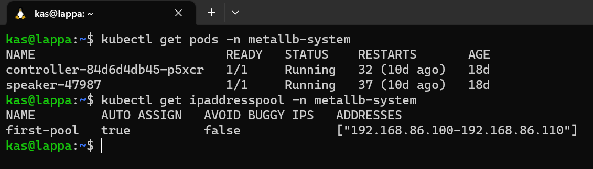

# Load balancer for K3s cluster

So now I have a cluster - woot! My first thing was to get stuck in and deploying some apps but quickly realised there were a couple of other things that needed to be considered. Say I deployed a web server to my cluster using a small nginx container. It's up and running but how do I access it when it is only routable within my cluster. if you look at the pods IP addresses, they are all *10.1.x.x* which is not in my home network.

Well, the answer is I need use a load balancer to expose that web server outside the cluster so that I can see it on my home network. When working in public cloud, these load balancers are usually provided by the cloud providers but I need one for my locally hosted environment.

After a bit of research, I found that [metallb](https://metallb.universe.tf/) is the best solution for this. You give it a "pool" of IP addresses within your home network to allocate to services that you want to expose and it just does it (much like a DHCP server)

## Installing applications

So this is my first app that I am going to install on my cluster so it took me a little bit of reading to get to this point but here are my key takeaways of installing this and any app:

* You can specify kubernetes a *manifest* which is basically a yaml file which allows you to declaritively specify what you want to install, where to install it from and what configurations you want and how to expose it.
* Most container applications are containerised with docker and often come with an associated docker-compose file. There is a nifty tool called [kompose](https://kompose.io/) which allows you to take these docker-compose files and it converts it to a kubernetes manifest for you to allow it to be deployed to your cluster - I plan on using this a lot.
* Another popular way of installing application is Helm. Helm is a package manager similar to apt (if you're familiar with Ubuntu) which allows you to easily install applications on to your cluster. All you need to do is specify the repo for the application you are wanting to install and it does the rest - I plan on using this a lot too.

## Installing metallb

Installing metallb is pretty easy out of the box. You are already provided with manifest to deploy using the **kubectl apply** command:

```bash
kubectl apply -f https://raw.githubusercontent.com/metallb/metallb/v0.13.9/config/manifests/metallb-native.yaml
```

This installs metallb into a new **namespace** called **metallb-system**. Namespaces are a kubenetes construct that basically allow you a way to organise resources within your cluster. I like to think of them as "folders" in a typical file system. So for metallb, all my resources will live in the metallb-system namespace. This allows for easy troubleshooting in the future as I know where they all live.


## Configuring metallb

Once installed, there were some configuration changes that needed to be made. As mentioned earlier, I needed to specify a pool of IP address for metallb to allocate out. I put this into another yaml file:

```yaml title="/home-lab/cluster-setup/metallb/metallb-ipconfig.yaml"
apiVersion: metallb.io/v1beta1
kind: IPAddressPool
metadata:
  name: first-pool
  namespace: metallb-system
spec:
  addresses:
  - 192.168.86.100-192.168.86.110

---
apiVersion: metallb.io/v1beta1
kind: L2Advertisement
metadata:
  name: default
  namespace: metallb-system
```

## Verifying installation

All done! Here are a few commands to verify my install:



But the real test is if it will allocate an IP to a service. Let's test it with reverse proxy service. Stay tuned as I will cover this in my next post!