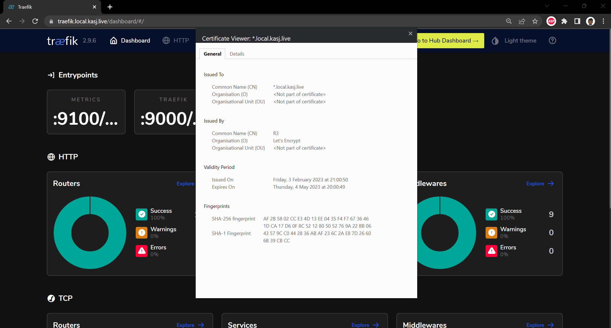

# Certificates for HTTPS

Automatic Certificate Management Environment (ACME) Certificates can are usually provided through issuers. LetsEncrypt is a nonprofit Certificate Authority that provides free TLS certificates to millions of websites all around the world. This is was good enough for me!

## Adding cloudflare token to cert-manager

First I needed a domain name which I purchased through CloudFlare but can be from anywhere really. You guessed it - mine is `kasj.live`. From there I needed to obtain an cloudflare token which was a personal access token to manage my DNS records in my cloudflare account. I needed this as I needed to provide it to cert-manager, which will be brokering the certificates between letsencrypt and my domain.

Providing cert-manager my cloudflare token could be done with a simple manifest:

```yaml title=secret-cf-token.yaml
apiVersion: v1
kind: Secret
metadata:
  name: cloudflare-token-secret
  namespace: cert-manager
type: Opaque
stringData:
  cloudflare-token: <redacted>
```

To apply the manifest run:

```bash
kubectl apply -f secret-cf-token.yaml
```

## Adding Let's Encrypt as an Issuer to cert-manager

I now need to let cert-manager know that I'll be using Let's Encrypt as my certificate issuer of choice through another manifest:

```yaml title="letsencrypt-production.yaml"
apiVersion: cert-manager.io/v1
kind: ClusterIssuer
metadata:
  name: letsencrypt-production
spec:
  acme:
    server: https://acme-v02.api.letsencrypt.org/directory
    email: kasunj@gmail.com
    privateKeySecretRef:
      name: letsencrypt-production
    solvers:
      - dns01:
          cloudflare:
            email: kasunj@gmail.com
            apiTokenSecretRef:
              name: cloudflare-token-secret
              key: cloudflare-token
        selector:
          dnsZones:
            - "kasj.live"
```

and execute using:

```bash
kubectl apply -f letsencrypt-production.yaml
```

## Issuing certificates

With the issuer now configured, all I need to do is request for a certificate. I will be hosting all my internal applications under the subdomain `local.kasj.live` so i will request for a wildcard certicate that covers `*.local.kasj.live`

The certificate is issued with the following manifest:

```yaml title="local-kasj-live.yaml"
apiVersion: cert-manager.io/v1
kind: Certificate
metadata:
  name: local-kasj-live
  namespace: default
spec:
  secretName: local-kasj-live-tls
  issuerRef:
    name: letsencrypt-production
    kind: ClusterIssuer
  commonName: "*.local.kasj.live"
  dnsNames:
  - "local.kasj.live"
  - "*.local.kasj.live"
```

and execute using:

```bash
kubectl apply -f local-kasj-live.yaml
```

Issuing  and validating the certificates takes time (20 minutes minimum). To check how things are progressing run:

```bash
kubectl get challenges
```

:::caution

You'll notice that I use the issuer name `letsencrypt-production` - I didn't jump straight to this but rather used `letsencrypt-staging` first to make sure all my configuration was correct. If you jump straight to production but if it doesn't work for whatever reason you might be locked out by letsencrypt for a period of time.

:::

## Testing the issued certificate

Once the `kubectl get challenges` command produces nothing, that's when you know the process is complete. To use a certificate, you need to ensure a couple of things:

* The certificate needs to be made available in multiple namespaces. The certificate only works if it is deployed in the same namespaces as the service you are using it for. With a bit of googling I've been using the following [solution](https://github.com/mittwald/kubernetes-replicator) for this.

* We use Traefik to specify and `ingressRoute` which essentionally provides traefik with the instructions on where to route traffic hitting the reverse proxy. We can also specify here that a certificate must be used.

To test above, I deployed the Traefik dashboard (with the help of their documentation and TechnoTim) with the following steps:

Create and deploy a middleware manifest that forces https:

```yaml title="middleware.yaml"
apiVersion: traefik.containo.us/v1alpha1
kind: Middleware
metadata:
  name: traefik-dashboard-basicauth
  namespace: traefik
spec:
  basicAuth:
    secret: traefik-dashboard-auth
```

Generate a credential whichi is mandatory for the dashboard:

```bash
# Generate a credential / password that’s base64 encoded
htpasswd -nb kas <redacted> | openssl base64
```

Create and apply a manifest to deploy the dashboard. Note you need to use the output from command above for the password:

```yaml
---
apiVersion: v1
kind: Secret
metadata:
  name: traefik-dashboard-auth
  namespace: traefik
type: Opaque
data:
  users: <redacted hased password which is output from above>
```

Finally I create a manifest for an `ingressRoute` which will route traffic from `traefik.local.kasj.live` to my dashboard using TLS certificate I just created:

```yaml title="traefik-ingress.yaml"
apiVersion: traefik.containo.us/v1alpha1
kind: IngressRoute
metadata:
  name: traefik-dashboard
  namespace: traefik
  annotations:
    kubernetes.io/ingress.class: traefik-external
spec:
  entryPoints:
    - websecure
  routes:
    - match: Host(`traefik.local.kasj.live`)
      kind: Rule
      middlewares:
        - name: traefik-dashboard-basicauth
          namespace: traefik
      services:
        - name: api@internal
          kind: TraefikService
  tls:
    secretName: local-kasj-live-tls
```

## And the results

So now if I navigate to `https://traefik.local.kasj.live` I can not see the traefik dashboard


And more importantly with a certificate issued from Let's Encrypt!

