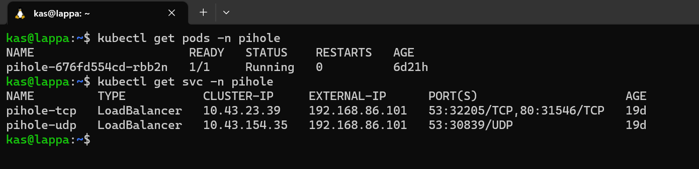
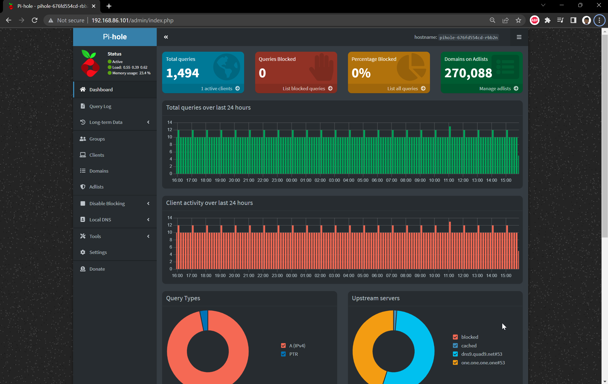
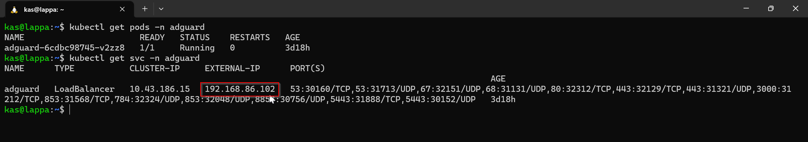
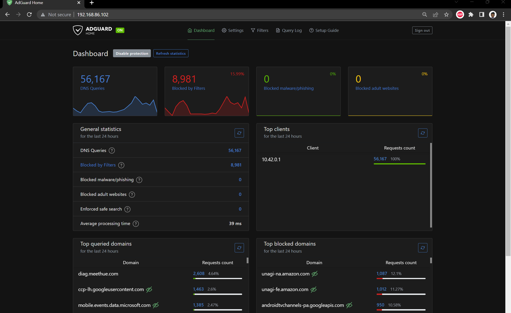

# Adblocker and DNS server

I've always been meaning to add an adblocker to my home network and now with the additional need to have internal hostnames for my services this would be a great time to put one in. There were two great open source solutions to consider:

* **Pihole** - Pi-hole is a general purpose network-wide ad-blocker that protects your network from ads and trackers without requiring any setup on individual devices. It is able to block ads on any network device

* **Adguard Home** - AdGuard Home is a network-wide software for blocking ads & tracking. After you set it up, it’ll cover ALL your home devices, and you don’t need any client-side software for that.


Honestly I really can't tell the difference so I decided to install both to trial!

## Pihole

### Installing Pihole

I wanted to create a bit of a file structure with all the required manifests which I can deploy at once:

* `01-pihole-namespaces.yaml` - manifest to create a namespace
* `02-pihole-configs.yaml` - manifest to specify configuration values such as whitelist domains and blocklists
* `03-pihole-deployment.yaml` - manifest to specify deployment of pihole such as the container location
* `04-pihole-service.yaml` - manifest to specify by port mappings and service exposure between container and pod

:::note
Worth noting here that I would normally be adding a `pihole-ingress.yaml` file here too to specify my traefik ingressRoute b resource but I won't be using traefik for this pihole or adguard home (as it will be a dns server)
:::

I also found out that you can run `kubectl apply -f` on and entire folder which deploys all the manifests within the folder specified so in my case:

```bash
kubectl apply -f pihole/
```
### Testing Pihole

As mentioned earlier, I didn't use Traefik for this service so I'm expecting that Metallb assigned a separate IP address allocated.



Looks good, so I just need to navigate to `http://192.168.86.101/admin` in my webbrowser to get to the admin portal



An voila! Happy days. I can now use this as my DNS server, define some local DNS entries and start blocking some ads!

## Adguard Home

### Installing Adguard Home

I thought I'd try installing Adguard Home slightly differently and use the Kompose tool instead. Kompose is simple, you give it a `docker-compose.yaml` and it outputs a set of kubernetes manifests for you.

First things first, we need a docker-compose file so I head on over to docker hub to grab one for adguard. The docker-compose file looks like this:

```yaml title="docker-compose.yaml"
version: '3.3'
services:
    adguard:
        container_name: adguardhome
        restart: unless-stopped
        volumes:
            - '/my/own/workdir:/opt/adguardhome/work'
            - '/my/own/confdir:/opt/adguardhome/conf'
        ports:
            - '53:53/tcp'
            - '53:53/udp'
            - '67:67/udp'
            - '68:68/udp'
            - '80:80/tcp'
            - '443:443/tcp'
            - '443:443/udp'
            - '3000:3000/tcp'
            - '853:853/tcp'
            - '784:784/udp'
            - '853:853/udp'
            - '8853:8853/udp'
            - '5443:5443/tcp'
            - '5443:5443/udp'
        image: run
```

After installing [kompose](https://kompose.io/), all I run `kompose convert` to give my manifest files. Kompose gives me the following manifest files:

* `adguard-claim0-persistentvolumeclaim.yaml`
* `adguard-claim1-persistentvolumeclaim.yaml`
* `adguard-deployment.yaml`
* `adguard-service.yaml`

To see the manifest in detail, I've included them in the Appendix below. 

:::note
I did need to make a slight change to the `adguard-service.yaml` auto generated file and that was to add the `LoadBalancer` service type. This tells Kubernetes that I needed and external IP from Metallb
:::

Finally I create a namespace and run all manifests with:

```bash
kubectl create namespace adguard
kubectl apply -f adguard/ -n adguard
```

## Testing Adguard Home

As with PiHole, I was expecting to see the pods running and an external IP that I could navigate to with my browser:



Sweet - looks like `192.168.86.102` was allocated.



## Closing thoughts

Both Pihole and Adguard Home are very similar from a feature set perspective so I haven't really managed to separate them as yet. If I was being super picky I'd say that Pihole is *slightly* more customisable with blocklists and Adguard Home has a *slightly* better UI. I haven't decided if one it better than the other so I'll keep them both running for now and switch DNS Servers from time to time.

## Appendix

### Pihole Manifests

For those interested in the manifests here they are:

#### Namespace

```yaml title="01-pihole-namespaces.yaml"
apiVersion: v1
kind: Namespace
metadata:
  name: pihole
```

#### Configuration


```yaml title="02-pihole-configs.yaml"
apiVersion: v1
kind: ConfigMap
metadata:
  name: custom.list
  namespace: pihole
data:
  custom.list: |
    192.168.86.41 k3smaster
    192.168.86.40 k3snode01
    192.168.86.100 traefik.local.kasj.live
    192.168.86.101 pihole.local.kasj.live
    192.168.86.100 dash.local.kasj.live
    192.168.86.100 grocy.local.kasj.live
    192.168.86.100 kuma.local.kasj.live
    192.168.86.100 cloud.local.kasj.live
    192.168.86.100 portainer.local.kasj.live
    192.168.86.100 argocd.local.kasj.live
---
apiVersion: v1
kind: ConfigMap
metadata:
  name: adlists.list
  namespace: pihole
data:
  adlists.list: |
    https://raw.githubusercontent.com/StevenBlack/hosts/master/hosts
    https://adaway.org/hosts.txt
    https://v.firebog.net/hosts/AdguardDNS.txt
    https://v.firebog.net/hosts/Admiral.txt
    https://raw.githubusercontent.com/anudeepND/blacklist/master/adservers.txt
    https://s3.amazonaws.com/lists.disconnect.me/simple_ad.txt
    https://v.firebog.net/hosts/Easylist.txt
    https://pgl.yoyo.org/adservers/serverlist.php?hostformat=hosts&showintro=0&mimetype=plaintext
    https://raw.githubusercontent.com/FadeMind/hosts.extras/master/UncheckyAds/hosts
    https://raw.githubusercontent.com/bigdargon/hostsVN/master/hosts
    https://v.firebog.net/hosts/static/w3kbl.txt
---
apiVersion: v1
kind: ConfigMap
metadata:
  name: whitelist.txt
  namespace: pihole
data:
  whitelist.txt: |
    ichnaea.netflix.com
    nrdp.nccp.netflix.com
    androidtvchannels-pa.googleapis.com
    lcprd1.samsungcloudsolution.net
```

#### Deployment

```yaml title="03-pihole-deployment.yaml"
as@lappa:~$ cat home-lab/prod-apps/pihole/03-pihole-deployment.yaml
apiVersion: apps/v1
kind: Deployment
metadata:
  labels:
    app: pihole
  name: pihole
  namespace: pihole
spec:
  replicas: 1
  selector:
    matchLabels:
      app: pihole
  strategy:
    rollingUpdate:
      maxSurge: 1
      maxUnavailable: 0
    type: RollingUpdate
  template:
    metadata:
      labels:
        app: pihole
    spec:
      containers:
      - env:
        - name: TZ
          value: Australia/Melbourne
        - name: WEBPASSWORD
          value:
        - name: DNS1
          value: 9.9.9.9
        - name: DNS2
          value: 1.1.1.1
        image: pihole/pihole:latest
        imagePullPolicy: IfNotPresent
        name: pihole
        ports:
        - name: dns-tcp
          containerPort: 53
          protocol: TCP
        - name: dns-udp
          containerPort: 53
          protocol: UDP
        - name: dhcp
          containerPort: 67
          protocol: UDP
        - name: web
          containerPort: 80
          protocol: TCP
        - name: https
          containerPort: 443
          protocol: TCP
        resources:
          requests:
            cpu: "20m"
            memory: "512Mi"
          limits:
            cpu: "250m"
            memory: "896Mi"
        readinessProbe:
          exec:
            command: ['dig', '@127.0.0.1', 'cnn.com']
          timeoutSeconds: 20
          initialDelaySeconds: 5
          periodSeconds: 60
        livenessProbe:
          tcpSocket:
            port: dns-tcp
          initialDelaySeconds: 15
          periodSeconds: 30
        volumeMounts:
        - name: etc-pihole
          mountPath: /etc/pihole
        - name: etc-dnsmasq
          mountPath: /etc/dnsmasq.d
        - name: var-log
          mountPath: /var/log
        - name: var-log-lighttpd
          mountPath: /var/log/lighttpd
        - name: adlists
          mountPath: /etc/pihole/adlists.list
          subPath: adlists.list
        - name: customlist
          mountPath: /etc/pihole/custom.list
          subPath: custom.list
      restartPolicy: Always
      volumes:
      - name: etc-pihole
        emptyDir:
          medium: Memory
      - name: etc-dnsmasq
        emptyDir:
          medium: Memory
      - name: var-log
        emptyDir:
          medium: Memory
      - name: var-log-lighttpd
        emptyDir:
          medium: Memory
      - name: adlists
        configMap:
          name: adlists.list
          items:
            - key: adlists.list
              path: adlists.list
      - name: customlist
        configMap:
          name: custom.list
          items:
            - key: custom.list
              path: custom.list
```

#### Service

```yaml title="04-pihole-service.yaml"
kind: Service
apiVersion: v1
metadata:
  name: pihole-udp
  namespace: pihole
  annotations:
    metallb.universe.tf/allow-shared-ip: dns
spec:
  selector:
    app: pihole
  ports:
  - protocol: UDP
    port: 53
    name: dnsudp
    targetPort: 53
  type: LoadBalancer

---
kind: Service
apiVersion: v1
metadata:
  name: pihole-tcp
  namespace: pihole
  annotations:
    metallb.universe.tf/allow-shared-ip: dns
spec:
  selector:
    app: pihole
  ports:
  - protocol: TCP
    port: 53
    name: dnstcp
    targetPort: 53
  - protocol: TCP
    port: 80
    name: web
    targetPort: 80
  type: LoadBalancer
```

### Adguard Manifests

#### Volume claims

```yaml title="adguard-claim0-persistentvolumeclaim.yaml"
apiVersion: v1
kind: PersistentVolumeClaim
metadata:
  creationTimestamp: null
  labels:
    io.kompose.service: adguard-claim0
  name: adguard-claim0
spec:
  accessModes:
    - ReadWriteOnce
  resources:
    requests:
      storage: 100Mi
status: {}
```

```yaml title="adguard-claim1-persistentvolumeclaim.yaml"
apiVersion: v1
kind: PersistentVolumeClaim
metadata:
  creationTimestamp: null
  labels:
    io.kompose.service: adguard-claim1
  name: adguard-claim1
spec:
  accessModes:
    - ReadWriteOnce
  resources:
    requests:
      storage: 100Mi
status: {}
```

#### Deployment

```yaml title="adguard-deployment.yaml"
apiVersion: apps/v1
kind: Deployment
metadata:
  annotations:
    kompose.cmd: kompose convert
    kompose.version: 1.26.0 (40646f47)
  creationTimestamp: null
  labels:
    io.kompose.service: adguard
  name: adguard
spec:
  replicas: 1
  selector:
    matchLabels:
      io.kompose.service: adguard
  strategy:
    type: Recreate
  template:
    metadata:
      annotations:
        kompose.cmd: kompose convert
        kompose.version: 1.26.0 (40646f47)
      creationTimestamp: null
      labels:
        io.kompose.service: adguard
    spec:
      containers:
        - image: adguard/adguardhome
          name: adguardhome
          ports:
            - containerPort: 53
            - containerPort: 53
              protocol: UDP
            - containerPort: 67
              protocol: UDP
            - containerPort: 68
              protocol: UDP
            - containerPort: 80
            - containerPort: 443
            - containerPort: 443
              protocol: UDP
            - containerPort: 3000
            - containerPort: 853
            - containerPort: 784
              protocol: UDP
            - containerPort: 853
              protocol: UDP
            - containerPort: 8853
              protocol: UDP
            - containerPort: 5443
            - containerPort: 5443
              protocol: UDP
          resources: {}
          volumeMounts:
            - mountPath: /opt/adguardhome/work
              name: adguard-claim0
            - mountPath: /opt/adguardhome/conf
              name: adguard-claim1
      restartPolicy: Always
      volumes:
        - name: adguard-claim0
          persistentVolumeClaim:
            claimName: adguard-claim0
        - name: adguard-claim1
          persistentVolumeClaim:
            claimName: adguard-claim1
status: {}
```

#### Service

```yaml title="adguard-service.yaml"
apiVersion: v1
kind: Service
metadata:
  annotations:
    kompose.cmd: kompose convert
    kompose.version: 1.26.0 (40646f47)
  creationTimestamp: null
  labels:
    io.kompose.service: adguard
  name: adguard
spec:
  ports:
    - name: "53"
      port: 53
      targetPort: 53
    - name: 53-udp
      port: 53
      protocol: UDP
      targetPort: 53
    - name: "67"
      port: 67
      protocol: UDP
      targetPort: 67
    - name: "68"
      port: 68
      protocol: UDP
      targetPort: 68
    - name: "80"
      port: 80
      targetPort: 80
    - name: "443"
      port: 443
      targetPort: 443
    - name: 443-udp
      port: 443
      protocol: UDP
      targetPort: 443
    - name: "3000"
      port: 3000
      targetPort: 3000
    - name: "853"
      port: 853
      targetPort: 853
    - name: "784"
      port: 784
      protocol: UDP
      targetPort: 784
    - name: 853-udp
      port: 853
      protocol: UDP
      targetPort: 853
    - name: "8853"
      port: 8853
      protocol: UDP
      targetPort: 8853
    - name: "5443"
      port: 5443
      targetPort: 5443
    - name: 5443-udp
      port: 5443
      protocol: UDP
      targetPort: 5443
  type: LoadBalancer
  selector:
    io.kompose.service: adguard
```
