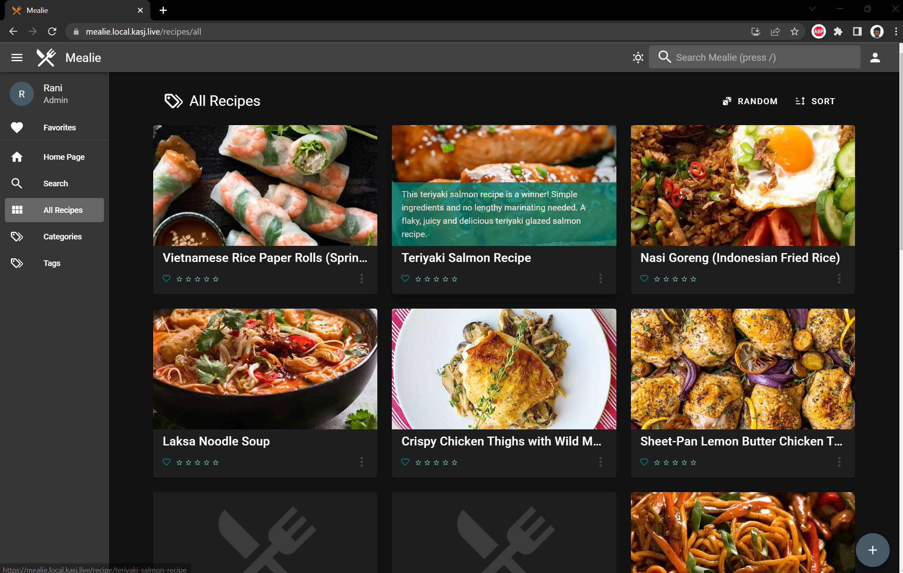
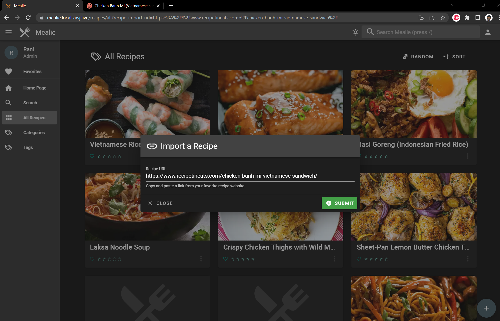
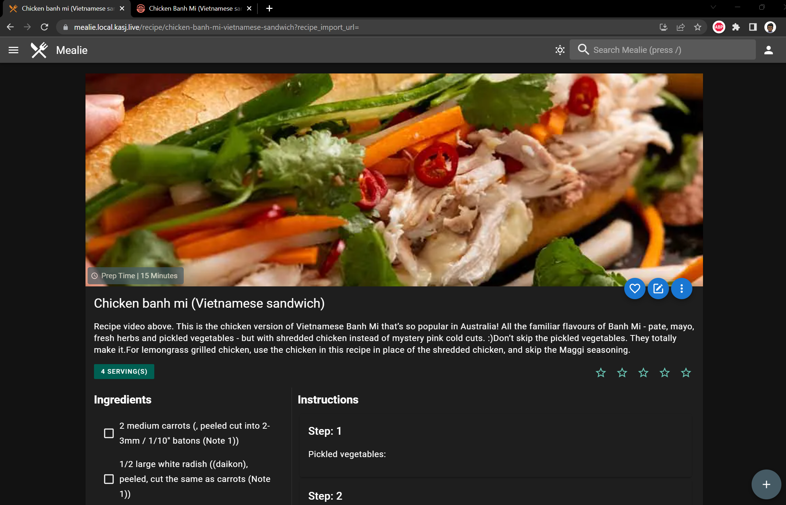
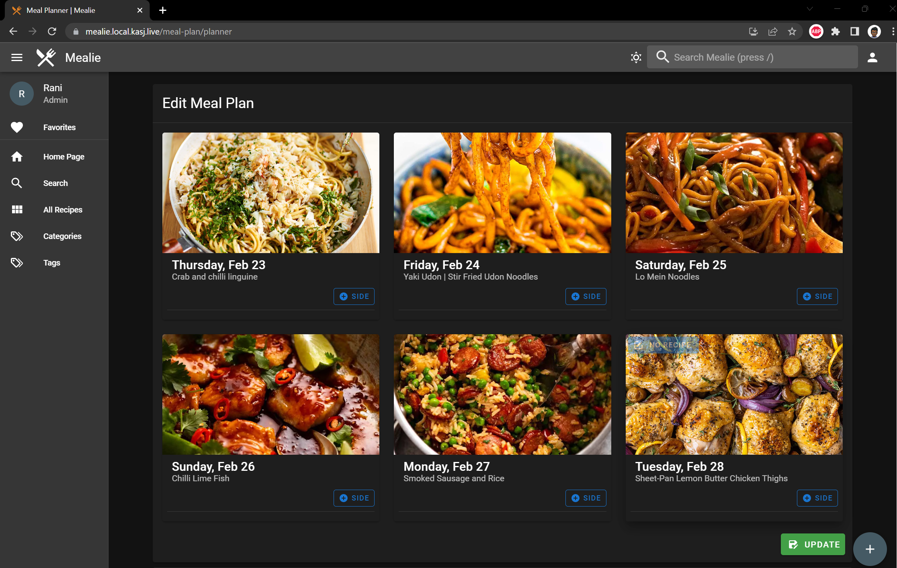
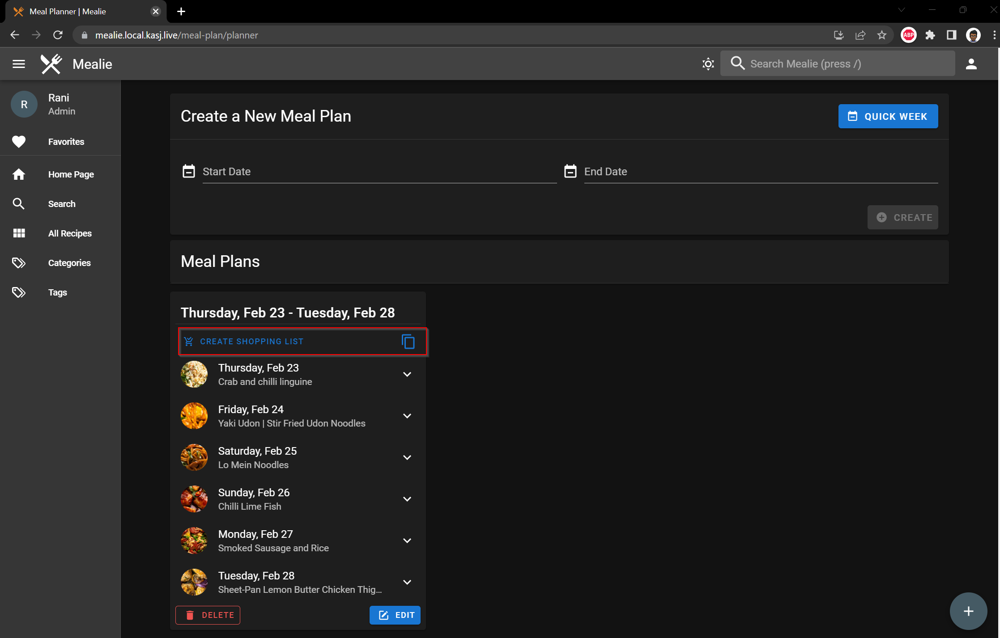
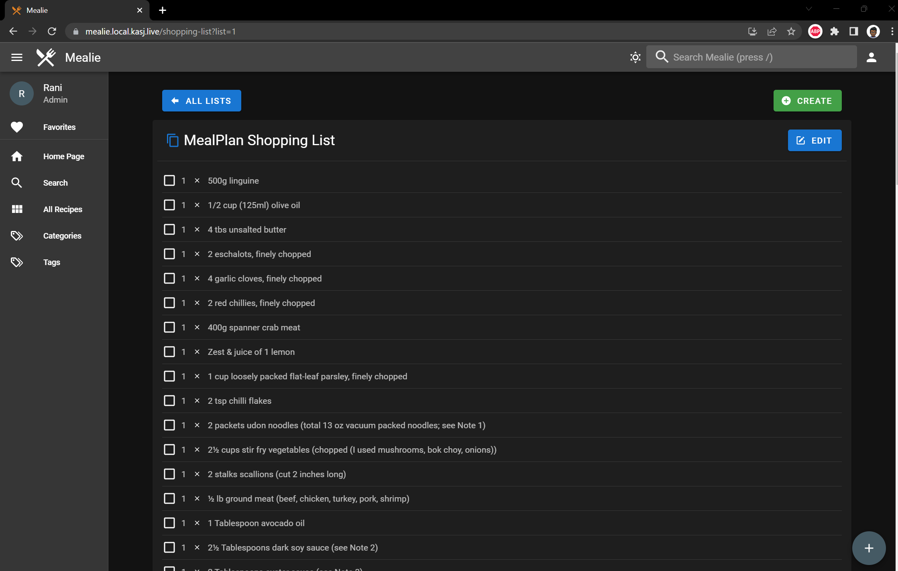

# Recipe and Shopping List Management with Mealie

During the COVID period, we start using online grocery shopping with click and collect. It has actually been saving us a bit of money as we're not tempted with impulse purchases while walking up and down the ailes. The downside is that the process can actually be quite cumbersome.

What we do now:

1. Spend ages looking for meal ideas for the week
2. Collate a list of recipes
3. Collate recipe ingredients
4. Check the pantry and finalise shopping list
5. Order items in shopping list

Now we haven't been necessarily doing it in that order either, we have been sporadically looking up recipe at a time and adding things to our online shopping cart over time, a lot of time. Now I don't think I can automate this completely but surely there was a better way to help reduce this time with a homelab app. Enter Mealie.

## Mealie

[Mealie](https://hay-kot.github.io/mealie/) is a self-hosted recipe manager and meal planner with a RestAPI backend and a reactive frontend application. It has some awesome features but the key ones I hope to leverage are:

* Ability to create a custome recipe book by importing online recipes
* Meal planner to choose our recipes for the week
* Shopping list creator based on our meal plan

## Installing Mealie

I'll be using the `kompose convert` method to install Mealie. I'm not going to cover it again but if you are interested check out my previous post as I installed **Adguard Home** with the same method.

The `kompose convert` command generated the following manifest files for me (I renamed them for my convenience):

* 01-mealie-claim0-persistentvolumeclaim.yaml
* 02-mealie-deployment.yaml
* 03-mealie-service.yaml

Deploying these files using `kubectl apply -f mealie/` deploys mealie in my cluster. Now what I need to do is expose this service to a webbrowser. If you've been following my previous posts, I've tried this in two ways, either giving it a network IP through Metallb or using my reverse proxy Traefik to route it through an internal domain. I'll be using the Traefik method today.

So to expose my service I create two additional files:

`04-mealie-headers.yaml` to specify some middleware to force https:

```yaml title="04-mealie-headers.yaml"
apiVersion: traefik.containo.us/v1alpha1
kind: Middleware
metadata:
  name: mealie-headers
  namespace: mealie
spec:
  headers:
    browserXssFilter: true
    contentTypeNosniff: true
    forceSTSHeader: true
    stsIncludeSubdomains: true
    stsPreload: true
    stsSeconds: 15552000
    customFrameOptionsValue: SAMEORIGIN
    customRequestHeaders:
      X-Forwarded-Proto: https
```

`05-mealie-ingress.yaml` to specify my routing rule so that when I navigate to `https://mealie.local.kasj.live` Traefik will route to my mealie application:

```yaml title="05-mealie-ingress.yaml"
apiVersion: traefik.containo.us/v1alpha1
kind: IngressRoute
metadata:
  name: mealie-ingress
  namespace: mealie
  annotations:
    kubernetes.io/ingress.class: traefik-external
spec:
  entryPoints:
    - websecure
  routes:
  - match: Host(`mealie.local.kasj.live`)
    kind: Rule
    services:
    - name: mealie
      port: 9925
    middlewares:
        - name: mealie-headers
  tls:
    secretName: local-kasj-live-tls
```

## Testing mealie

Navigate to  `mealie.local.kasj.live` and woot - we have an application!



Cool feature #1 - **Recipe Import**. All I need to do is enter a recipe URL



And mealie imports it for me!



Once I have a bunch of recipes imported it is time for feature #2 - **Weekly Meal Planner**. I simply just pick from my imported recipes which is pretty quick!



Sweet, now that I have weekly meal plan all I need is a shopping list. Hey look feature number #3 - **Shopping List**. Mealie takes all the ingredients from the meals you've selected in your weekly meal plan and throws them in a list for you.



All we need to do now is trim the list based on what we have already, split the list between us and add to shopping cart!




## Closing thoughts

We've been using Mealie for about a week now and we've cut the time spent on grocery ordering signficantly. Happy wife - thanks mealie!