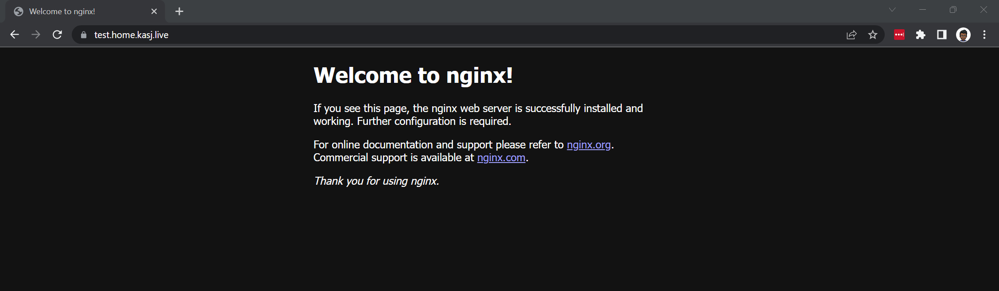
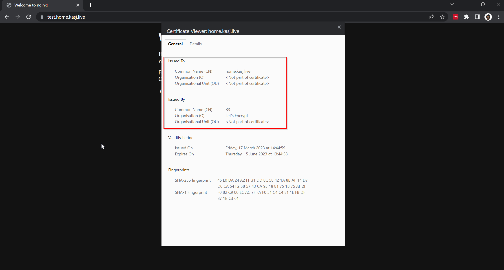

# Fixing my wildcard certificates

In an earlier post, I installed cert-manager to automatically manage my SSL certificates for TLS for my home-lab services. Given it was a set of services within my internal network, I was comfortable with issuing a single wildcard certificate `*.local.kasj.live`. 

## The problem

I've since realised a bit of an issue. The wildcard certificates that are issued are issued as a kubernetes `secret` resource which is specific to a namespace. This meant that in order for me to use the wildcard cert for all my services, I needed to deploy all my services into the same namespace (not ideal). 

## The research

Turns out there were many solutions to this, many of which I don't really understand but I tried anyway. This included:

* [Installing traefik again with K3s out of the box](https://major.io/2021/08/16/wildcard-letsencrypt-certificates-traefik-cloudflare/) and getting it to issue certs through Let's Encrypt without cert-manager. This didn't seem to change the behaviour I was experiencing before.
* [Storing the wildcard secret in a persistent volume](https://lachlan.io/blog/using-wildcard-certificates-with-traefik-and-k3s) for cert-manager to pick up as a "default" certificate when nothing else was provided. Unfortunately I couldn't get the persistent volume to work either

## The solution

I landed with a solution outline [here](https://itobey.dev/wildcard-certificates-dns-challenges-and-traefik-in-kubernetes/) and it still doesn't work how I want it to but its definitely a step forward. 

The first few steps are exactly as I'd performed in my earlier post:

1. Install Traefik
2. Install Cert-Manager
3. Set up Let's Encrypt as an Issuer

This is where I learnt something new:

4. Issue a wilcard certificate in the **same namespace as Traefik** in my case this was the `kube-system` namespace - I also issued myself a new one here to keep things fresh `*.home.kasj.live`

```yaml title="/home-lab/cluster-setup/cert-manager/wildcard-cert.yaml"
---
apiVersion: cert-manager.io/v1
kind: Certificate
metadata:
  name: wildcard-home-kasj-live
  namespace: kube-system
spec:
  secretName: wildcard-home-kasj-live-tls
  issuerRef:
    name: letsencrypt-production
    kind: ClusterIssuer
  # commonName: "*.home.kasj.live"
  dnsNames:
    - "home.kasj.live"
    - "*.home.kasj.live"
```

Traefik by default normally uses its own self-signed certificate for each ingress service that you define. What I needed to configure was something to tell Traefik to serve the new wildcard certifate I'd created instead. This can be done through a kubernetes resource called **TLSStore**. 

5. Create a TLSStore resource with the name  `default`. According to the article above, it needed to be called default to be picked up by Traefik by default:

```yaml title="/home-lab/cluster-setup/cert-manager/tls-store.yaml"
---
apiVersion: traefik.containo.us/v1alpha1
kind: TLSStore
metadata:
  name: default
  namespace: kube-system
spec:
  defaultCertificate:
    secretName: wildcard-home-kasj-live-tls"
```

6. Restart Traefik deployment so that it knows to pick up the new cert by default

## Testing the new solution

To test if Traefik was issuing my new wildcard certificate by default, I created a simple nginx server and exposed it using the following manifest on `test.home.kasj.live`:

```yaml title="/home-lab/prod-apps/nginx/ingress.yaml"
---
apiVersion: networking.k8s.io/v1
kind: Ingress
metadata:
  name: nginx
  namespace: nginx
  annotations:
    kubernetes.io/ingress.class: traefik
    traefik.ingress.kubernetes.io/redirect-entry-point: https
spec:
  rules:
    - host: test.home.kasj.live
      http:
        paths:
          - backend:
              service:
                name: nginx
                port:
                  number: 80
            path: /
            pathType: Prefix
```

Note: I've moved away from the `IngressRoute` resource to `Ingress`

**Success!**



Now earlier, I mentioned it still wasn't working as I wanted it to and that's because there is still an issue with some services that already expose their services on SSL/HTTPS (Port 443) by default like nextcloud. Stay tuned for a future post on how I tackle that one but for now I'm going to enjoy this win.

