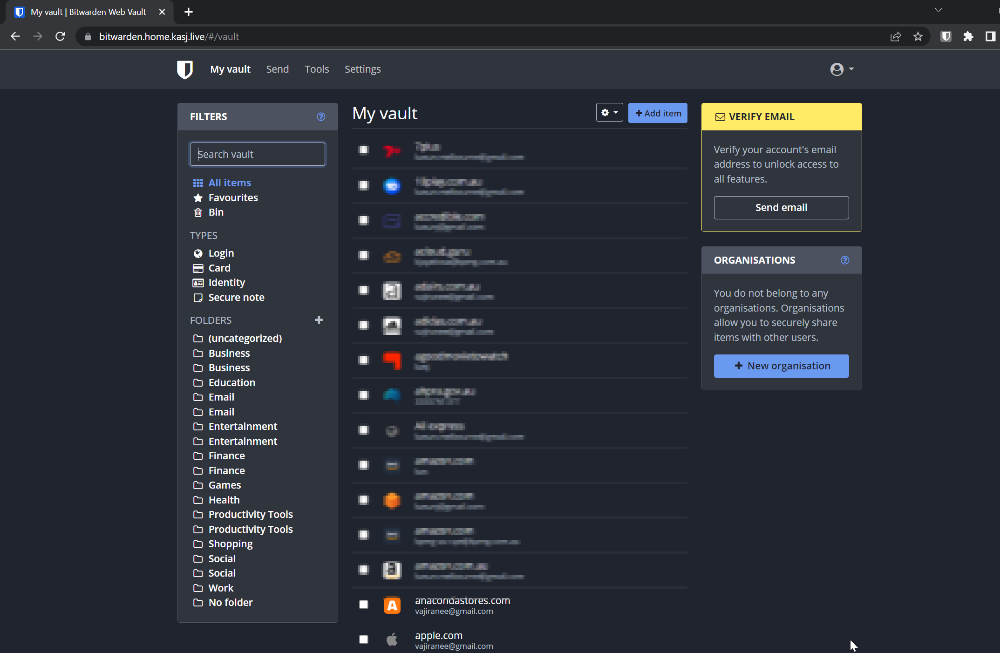

# I switched to a self-hosted password manager and I'm not going back

  One of the biggest reasons for creating a homelab is I wanted the ability to leverage the some of the great services and solutions that were available in the public cloud within the safety of my home network where my data was out of reach in the wild world of the internet. I can't think of a better example of this than Password Management. 

The last 12 months have been incredibly eye opening for a lot of folks when it comes to data privacy with some pretty large breaches impacting millions of people. The Office of the Australian Information Commissioner [reports](https://www.oaic.gov.au/privacy/notifiable-data-breaches/notifiable-data-breaches-publications/notifiable-data-breaches-report-july-to-december-2022) 497 breaches were notified compared with 393 in January to June 2022 – a 26% increase, most of which were malicious or criminal attacks.

So many of us (me included) have so many accounts/subscriptions/emails, it is very hard for us to keep up with strong password requirements and practices. Luckily for us there are a number of excellent solutions to generate and manage passwords for us so we don't have to. Passwords can now be long and complicated which dramatically reduce the chances of being hacked or exploited. 

I've been using [LastPass](https://www.lastpass.com/) for a number of years and has served me well however late last year I was reminded that there will be attempts to access your data. In December 2022, "an unauthorized party gained access to a third-party cloud-based storage service, which LastPass uses to store archived backups of our production data. Whilst no customer data was accessed during the August 2022 incident, some source code and technical information were stolen from our development environment and used to target another employee, obtaining credentials and keys which were used to access and decrypt some storage volumes within the cloud-based storage service." [source](https://blog.lastpass.com/2022/12/notice-of-recent-security-incident/)

I know, no customer data was stolen and even if the customer data was stolen, it is all encrypted anyway. Also, if I wasn't using LastPass, there was far more of chance I re-use or use weak passwords making it more likely to be exploited.

## There is always a self-hosted alternative

Having a free, open-source alternative to a service I would've normally paid for is awesome but this one felt really good. Enter [Bitwarden](https://bitwarden.com/). It is a fantastic, self-hosted, free alternative password manager that does pretty much everything LastPass does (all the features I've been using anyway). Passwords are encrypted, it comes with an official Android and IoS app so that you can access your passwords from your phone and most importantly everything is stored locally.

## Installing Bitwarden

I was gearing up to write some manifests when I found a great [repo](https://github.com/guerzon/bitwarden-kubernetes) that had some great ones pre-written. Some minor tweaks and it all deployed fine. 

One thing I deliberately didn't configure was a mail server (which Bitwarden needs to send out an email verification or send you a password hint if needed). I plan on revisiting this after I deploy a small mail server later.

## Using Bitwarden

Using Bitwarden couldn't be easier either, it even comes with a handy little [guide(https://bitwarden.com/help/import-from-lastpass/)] to help you import all your passwords from LastPass

## Closing thoughts

Password managers are a must have service for everyone and whilst there are a number pretty great cloud-based password managers out there (Google and Apple included), it is quite nice knowing that I don't have to store my data encrypted or otherwise on a server somewhere that isn't one that I own and know. For that reason (and really that reason alone) I'll be sticking to Bitwarden.

