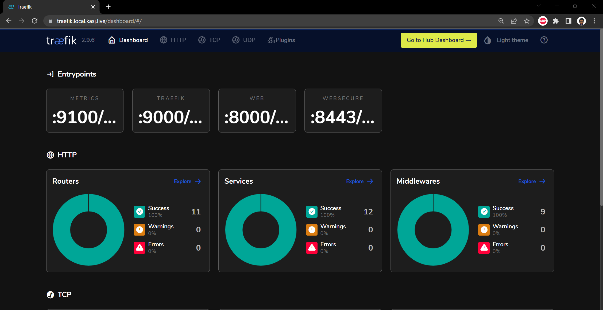
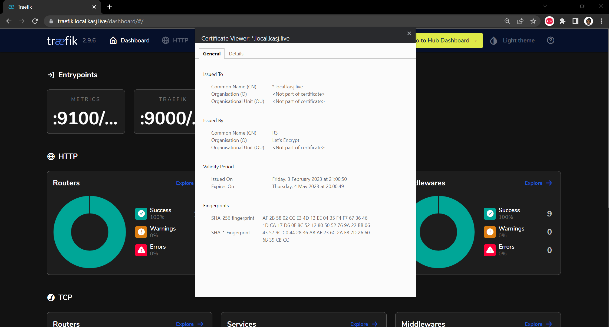

# Traefik Dashboard

Create and deploy a middleware manifest that forces https:

```yaml title="middleware.yaml"
apiVersion: traefik.containo.us/v1alpha1
kind: Middleware
metadata:
  name: traefik-dashboard-basicauth
  namespace: traefik
spec:
  basicAuth:
    secret: traefik-dashboard-auth
```

Generate a credential whichi is mandatory for the dashboard:

```bash
# Generate a credential / password that’s base64 encoded
htpasswd -nb kas <redacted> | openssl base64
```

Create and apply a manifest to deploy the dashboard. Note you need to use the output from command above for the password:

```yaml
---
apiVersion: v1
kind: Secret
metadata:
  name: traefik-dashboard-auth
  namespace: traefik
type: Opaque
data:
  users: <redacted hased password which is output from above>
```

Finally I create a manifest for an `ingressRoute` which will route traffic from `traefik.local.kasj.live` to my dashboard using TLS certificate I just created:

```yaml title="traefik-ingress.yaml"
apiVersion: traefik.containo.us/v1alpha1
kind: IngressRoute
metadata:
  name: traefik-dashboard
  namespace: traefik
  annotations:
    kubernetes.io/ingress.class: traefik-external
spec:
  entryPoints:
    - websecure
  routes:
    - match: Host(`traefik.local.kasj.live`)
      kind: Rule
      middlewares:
        - name: traefik-dashboard-basicauth
          namespace: traefik
      services:
        - name: api@internal
          kind: TraefikService
  tls:
    secretName: local-kasj-live-tls
```

So now if I navigate to `https://traefik.local.kasj.live` I can not see the traefik dashboard



And more importantly with a certificate issued from Let's Encrypt!

